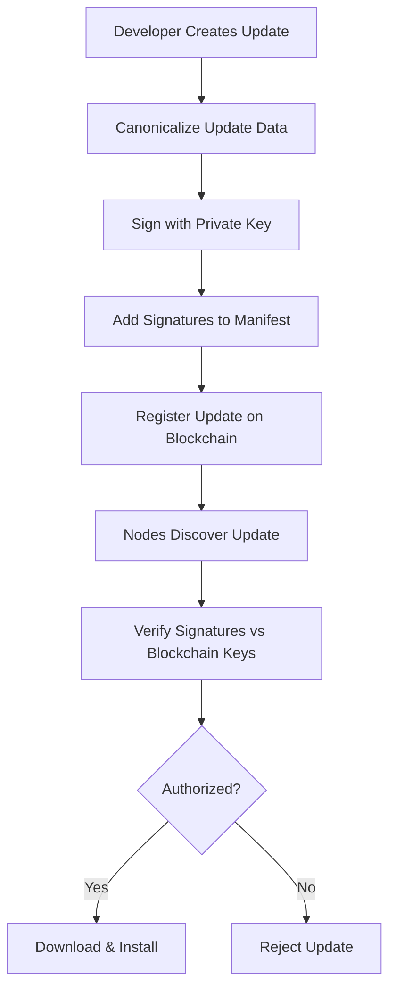

# OTA Update Authorization System

**CONFIDENTIAL - AUTHORIZED PERSONNEL ONLY**

This document details the secure over-the-air (OTA) update system for PiSecure, which ensures that **only authorized developers** can deploy updates to the network.

## Overview

PiSecure uses a **blockchain-based cryptographic authorization system** where:

- Updates must be signed by authorized private keys
- Authorized keys are registered as immutable blockchain transactions
- Multi-signature thresholds prevent single points of failure
- Compromised keys can be instantly revoked network-wide

## Security Architecture

### Cryptographic Foundations

- **RSA-PSS signatures** with 2048-bit keys
- **SHA-256 canonicalization** for consistent signing
- **Multi-signature support** (N-of-M threshold)
- **Blockchain-based key registry** (immutable audit trail)

### Authorization Flow



## Key Management

### Generating Keys

```bash
# Generate new signing keypair (RSA-2048)
pisecure generate-signing-key

# Creates:
# - /etc/pisecure/update_signing_key.pem (encrypted private key)
# - Extracted public key for registration
```

### Registering Keys

```bash
# Register public key as authorized
pisecure register-update-key developer_key public_key.pem

# Creates blockchain transaction:
# {
#   "type": "update_authority_registration",
#   "authority_data": {
#     "public_keys": {
#       "developer_key": {
#         "public_key": "-----BEGIN PUBLIC KEY-----...",
#         "permissions": ["sign_updates"]
#       }
#     }
#   }
# }
```

### Setting Thresholds

```bash
# Require N signatures for updates
pisecure set-update-threshold 1  # Solo development
pisecure set-update-threshold 2  # Team development
```

### Revoking Keys

```bash
# Immediately revoke compromised key
pisecure revoke-update-key compromised_key_id

# Creates blockchain transaction:
# {
#   "type": "update_authority_revocation",
#   "revoked_key_id": "compromised_key_id"
# }
```

## Update Creation Workflow

### Step 1: Create Update Manifest

```json
{
  "version": "1.1.0",
  "description": "Add IoT sensor support",
  "publisher": "developer",
  "target_hardware": ["raspberry-pi"],
  "file_mapping": {
    "sensor_plugin.py": "/opt/pisecure/plugins/sensor_plugin.py",
    "sensor_config.yaml": "/etc/pisecure/sensor_config.yaml"
  },
  "post_install": [
    "systemctl restart pisecure-sensor",
    "pisecure install-plugin /opt/pisecure/plugins/sensor_plugin.py"
  ],
  "rollback_files": [
    "/opt/pisecure/plugins/sensor_plugin.py",
    "/etc/pisecure/sensor_config.yaml"
  ]
}
```

### Step 2: Sign Update

```bash
# Sign with authorized private key
pisecure sign-update update_manifest.json

# Output:
# ✍️ Signing update data...
# ✅ Update signed successfully!
#    Signature: a1b2c3d4e5f6789abcdef...
#    Signed file: update_manifest_signed.json

# Signed manifest contains:
{
  "version": "1.1.0",
  "description": "Add IoT sensor support",
  "...": "...",
  "signatures": [
    {
      "key_id": "developer_key",
      "signature": "a1b2c3d4e5f6789abcdef..."
    }
  ]
}
```

### Step 3: Register Update

```bash
# Register signed update on blockchain
pisecure register-update update_manifest_signed.json

# Creates transaction:
# {
#   "type": "update_registration",
#   "update_hash": "abc123...",
#   "version": "1.1.0",
#   "manifest": {...},
#   "signatures": [...]
# }
```

## Node Update Process

### Discovery

```bash
# Nodes check for updates
pisecure check-updates

# Queries blockchain for update_registration transactions
# Compares version numbers with current installation
```

### Verification

```bash
# Verify downloaded update
pisecure verify-update downloaded_update.tar.gz

# Process:
# 1. Extract manifest from package
# 2. Canonicalize manifest data
# 3. Verify signatures against blockchain-registered keys
# 4. Check signature threshold requirements
# 5. Validate package integrity
```

### Installation

```bash
# Apply verified update
pisecure download-update update_hash --apply

# Process:
# 1. Create system backup
# 2. Extract and install files
# 3. Run post-install scripts
# 4. Restart services if needed
# 5. Log successful update
```

## Security Features

### Signature Verification

- **Canonical JSON**: Deterministic serialization prevents tampering
- **PSS Padding**: Probabilistic padding prevents replay attacks
- **Key Validation**: Only active, non-revoked keys accepted
- **Threshold Enforcement**: Minimum signatures required

### Package Security

- **SHA-256 Integrity**: Package contents hashed and verified
- **Path Traversal Protection**: Safe file extraction
- **Rollback Capability**: Automatic reversion on failure
- **Backup Creation**: Pre-update system snapshots

### Network Security

- **IPFS Distribution**: Decentralized content delivery
- **Blockchain Registry**: Tamper-proof update metadata
- **Peer Verification**: Updates validated across multiple nodes
- **Rate Limiting**: Prevents update spam attacks

## Audit & Compliance

### Blockchain Audit Trail

All authorization events are immutably recorded:

```bash
# Query authorization history
pisecure blockchain query type=update_authority_registration
pisecure blockchain query type=update_authority_revocation
pisecure blockchain query type=update_registration
```

### Key Status Monitoring

```bash
# List all authorized keys
pisecure list-update-keys

# Output:
# 🔑 Authorized Update Keys (Threshold: 1)
#
# ✅ Active Keys:
#    developer_key:
#      Added: 2026-01-02 11:30:00
#      Permissions: sign_updates
#      Last Used: 2026-01-02 11:45:00
#
# 🚫 Revoked Keys:
#    old_key (Revoked: 2026-01-01 10:00:00)
```

### Update History

```bash
# Show update installation history
pisecure update-status

# Output:
# Current Version: 1.1.0
# Available Updates: 0
# Backups Available: 3
# Last Update Check: 2026-01-02 11:50:00
```

## Emergency Procedures

### Update Failure Recovery

```bash
# Automatic rollback (happens automatically on failure)
# Manual rollback if needed
pisecure rollback

# Emergency rollback to last known good state
pisecure emergency-rollback
```

### Key Compromise Response

1. **Immediate Revocation**
   ```bash
   pisecure revoke-update-key compromised_key
   ```

2. **Generate Replacement**
   ```bash
   pisecure generate-signing-key
   pisecure register-update-key new_key public_key.pem
   ```

3. **Increase Security**
   ```bash
   pisecure set-update-threshold 2  # Require 2 signatures
   ```

### Network Compromise Response

1. **Stop All Updates**
   ```bash
   # Revoke all keys temporarily
   pisecure revoke-update-key all_active_keys
   ```

2. **Generate New Key Infrastructure**
   ```bash
   # Create new key on secure system
   pisecure generate-signing-key
   pisecure register-update-key emergency_key public_key.pem
   ```

3. **Selective Re-authorization**
   ```bash
   # Re-register trusted keys individually
   pisecure register-update-key trusted_key trusted_public_key.pem
   ```

## Best Practices

### Development Security

- **Air-gapped Key Generation**: Generate keys offline
- **Hardware Security Modules**: Use TPM/HSM for key storage
- **Regular Key Rotation**: Rotate keys every 90 days
- **Multi-signature**: Use 2+ signatures for production

### Operational Security

- **Monitor Key Usage**: Audit signature events regularly
- **Backup Keys Securely**: Encrypted offline backups
- **Test Updates**: Always test on development nodes first
- **Version Control**: Keep update manifests in secure repository

### Compliance

- **Audit Logging**: All authorization events logged
- **Access Control**: Limit key generation to authorized personnel
- **Change Management**: Document all key lifecycle events
- **Incident Response**: Established procedures for key compromise

## Troubleshooting

### Common Issues

#### Signature Verification Fails
```bash
# Check key status
pisecure list-update-keys

# Verify key permissions
pisecure blockchain query key_id=problematic_key

# Check signature format
openssl dgst -sha256 -verify public_key.pem -signature sig.bin manifest.json
```

#### Update Registration Fails
```bash
# Check blockchain connectivity
pisecure status

# Verify manifest format
python -m json.tool update_manifest.json

# Check signature validity
pisecure verify-update update.tar.gz
```

#### Key Registration Fails
```bash
# Verify public key format
openssl rsa -pubin -in public_key.pem -text

# Check blockchain space
pisecure blockchain info

# Verify permissions
pisecure list-update-keys
```

---

**Document Version**: 1.0.0
**Last Updated**: January 2, 2026
**Classification**: CONFIDENTIAL